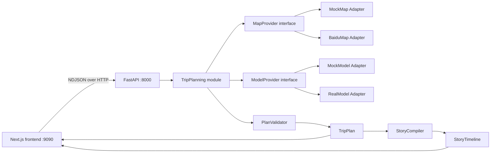
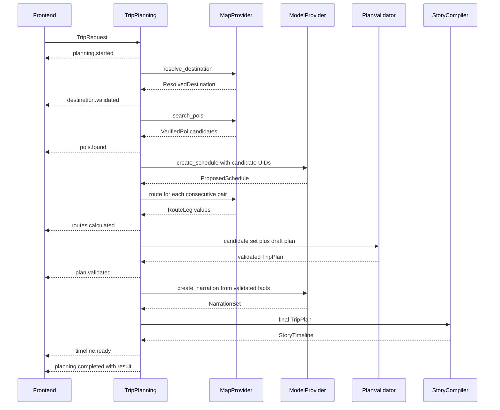

# Lumivo Backend Design

Date: 2026-08-18

Status: Fixture, full-real, canonical NDJSON, and stateless revision paths implemented locally; live smoke and hardening pending

## 1. Purpose

Lumivo Backend converts a natural-language trip request into two validated products:

- `TripPlan`: the canonical itinerary containing verified places, daily ordering, routes, timing, narration, and warnings.
- `StoryTimeline`: deterministic playback commands derived from one exact TripPlan version.

The backend runs locally and serves the sibling Next.js frontend. The MVP optimizes for a complete local product flow rather than deployment infrastructure.

## 2. Scope

### Included

- China-region validation.
- Baidu destination, POI, coordinate, and route integration.
- AI selection and scheduling constrained to verified candidates.
- Plan validation and grounded narration.
- StoryTimeline compilation.
- Initial planning and stateless revision endpoints.
- Streaming progress, cancellation, structured errors, and deterministic fixture mode.

### Excluded

- Authentication, user profiles, cloud history, and shared trips.
- Databases, ORMs, Redis, caches, queues, and scheduled jobs.
- Deployment, containers, domains, TLS, monitoring platforms, and release automation.
- GPS tracking, turn-by-turn guidance, live traffic rerouting, and overseas planning.

## 3. System context



FastAPI owns transport and dependency assembly. Domain models, validation, and compilation do not depend on FastAPI. External SDK and HTTP payloads remain inside provider Adapters.

## 4. Planned project structure

```text
lumivo-backend/
├─ app/
│  ├─ __init__.py
│  ├─ main.py
│  ├─ settings.py
│  ├─ api/
│  │  ├─ health.py
│  │  └─ trips.py
│  ├─ domain/
│  │  ├─ errors.py
│  │  ├─ trips.py
│  │  └─ story.py
│  ├─ planning/
│  │  ├─ service.py
│  │  └─ validator.py
│  ├─ story/
│  │  └─ compiler.py
│  ├─ providers/
│  │  ├─ map_provider.py
│  │  ├─ model_provider.py
│  │  ├─ mock_map.py
│  │  ├─ mock_model.py
│  │  ├─ baidu_map.py
│  │  └─ real_model.py
│  └─ fixtures/
│     └─ nanjing.py
├─ tests/
│  ├─ api/
│  ├─ planning/
│  ├─ providers/
│  └─ story/
├─ .env.example
├─ .gitignore
└─ pyproject.toml
```

Files are grouped by responsibility. Route handlers remain thin; planning policy stays in `planning`; map and model variation stays in `providers`; pure playback derivation stays in `story`.

## 5. Canonical domain models

Pydantic models are the source of truth. Every coordinate crossing MapProvider uses BD-09.

```py
from datetime import date, datetime
from enum import StrEnum
from pydantic import BaseModel, Field


class CoordinateSystem(StrEnum):
    BD09 = "BD09"


class GeoPoint(BaseModel):
    lng: float = Field(ge=-180, le=180)
    lat: float = Field(ge=-90, le=90)
    crs: CoordinateSystem = CoordinateSystem.BD09


class TravelMode(StrEnum):
    WALK = "walk"
    TRANSIT = "transit"
    DRIVE = "drive"
    RIDE = "ride"


class TripRequest(BaseModel):
    destination: str
    days: int = Field(ge=1, le=14)
    message: str
    departure: str | None = None
    start_date: date | None = None
    interests: list[str] = Field(default_factory=list)
    pace: str | None = None
    budget: str | None = None
    transport: list[TravelMode] = Field(default_factory=list)


class VerifiedPoi(BaseModel):
    uid: str
    name: str
    address: str
    point: GeoPoint
    opening_hours: str | None = None
    recommended_stay_minutes: int = Field(gt=0)
    source: str
    verified_at: datetime


class RouteLeg(BaseModel):
    id: str
    from_poi_uid: str
    to_poi_uid: str
    mode: TravelMode
    distance_meters: int = Field(gt=0)
    duration_seconds: int = Field(gt=0)
    geometry: list[GeoPoint] = Field(min_length=2)
```

`TripStop` contains one VerifiedPoi, optional arrival/departure times, and grounded narration. `TripDay` contains ordered stops and the route leg between each consecutive pair. `TripPlan` contains `id`, monotonically increasing `version`, destination, summary, days, and warnings.

`StoryTimeline` contains `trip_id`, `trip_version`, total duration, and ordered chapters. Each command has a stable ID, chapter ID, semantic type, start time, duration, easing, and a type-specific payload.

## 6. Provider interfaces

### MapProvider

```py
class MapProvider(Protocol):
    async def resolve_destination(self, name: str) -> ResolvedDestination: ...
    async def search_pois(self, query: PoiSearchQuery) -> list[VerifiedPoi]: ...
    async def route(self, request: RouteRequest) -> RouteLeg: ...
```

`MockMapAdapter` returns deterministic Nanjing fixture data. `BaiduMapAdapter` calls Baidu services, checks provider status codes, normalizes BD-09 data, and converts responses into domain models. Raw Baidu structures never escape the Adapter.

### ModelProvider

```py
class ModelProvider(Protocol):
    async def create_schedule(self, prompt: SchedulePrompt) -> ProposedSchedule: ...
    async def create_narration(self, prompt: NarrationPrompt) -> NarrationSet: ...
```

`MockModelAdapter` returns deterministic selections and narration. `RealModelAdapter` uses structured output and Pydantic validation. Its schedule output contains only candidate POI UIDs, order, suggested stay time, and rationale. Unknown UIDs cause `MODEL_OUTPUT_INVALID`.

The concrete AI vendor is selected during real-model integration. Vendor choice does not alter the ModelProvider interface or domain models.

## 7. Planning flow



TripPlanning never asks the model to provide coordinates or route facts. It retrieves routes only after the model selects a candidate order, then rejects any schedule that cannot be completed with valid route legs.

## 8. Validation rules

PlanValidator is synchronous, pure, and table-tested. It verifies:

- the resolved destination is inside the supported China region;
- requested and produced day counts match;
- every stop UID belongs to the verified candidate set;
- every point is valid BD-09;
- every consecutive stop pair has exactly one route leg;
- route endpoints match the referenced POIs;
- distances, route durations, and stay durations are positive;
- known opening hours do not conflict with the schedule;
- uncertain opening hours produce warnings;
- every day contains playable content.

The validator returns a new validated model or raises structured domain errors. It never repairs invented POIs or route geometry.

## 9. Story compilation

StoryCompiler is deterministic for the same TripPlan ID and version. It creates:

1. An introduction chapter focused on the globe.
2. A projection transition and city camera flight.
3. Day and route chapters with POI display, route draw, route follow, and narration commands.
4. A closing chapter.

Animation durations are presentation durations, not real travel durations. Route commands reference route-leg IDs; the frontend prepares its MapStage using the returned TripPlan before playback.

## 10. HTTP interface

### `GET /api/v1/health`

Returns process health and configured Adapter modes without secrets.

### Current frontend compatibility routes

The Python service also keeps the existing frontend contract while the frontend
has not moved to the canonical `/api/v1` client:

- `GET /health` returns `{ "status": "ok", "model": string }`.
- `POST /api/chat` proxies an OpenAI-compatible chat completion. Without a
  stream request it returns `{ "message": { "role": "assistant", "content":
  string } }`; with `Accept: text/event-stream` or `?stream=true` it returns
  SSE `delta` events followed by one `done` event.
- `POST /api/trips/plan` accepts the current frontend request shape and returns
  a JSON `PlanningResult`. In `fixture` mode it returns the deterministic
  Nanjing three-day fixture; in `full-real`/`map-real` mode it uses Baidu
  verified POIs and DirectionLite route facts plus constrained model output.

These routes are a compatibility boundary, not a second planning contract.
The canonical NDJSON flow is now the frontend planning path; these routes remain as compatibility boundaries for existing clients.

### `POST /api/v1/trips/plan`

Accepts `TripRequest` and returns `application/x-ndjson`. Each line is one event envelope:

```json
{"requestId":"req_123","sequence":1,"type":"planning.started","message":"开始规划行程","data":null}
```

The final `planning.completed` event contains `{ "plan": TripPlan, "timeline": StoryTimeline }` in `data`.

### `POST /api/v1/trips/revise`

Accepts the complete current TripPlan and a revision instruction. It returns a new plan with the same ID, incremented version, and a matching newly compiled timeline. No server-side session is required.

The event sequence is strictly increasing per request. Client disconnect cancels remaining provider work where cancellation is supported.

## 11. Error model

```py
class AppError(BaseModel):
    code: str
    message: str
    retryable: bool
    details: dict[str, object] | None = None
```

MVP error codes are:

- `UNSUPPORTED_REGION`
- `POI_NOT_FOUND`
- `ROUTE_UNAVAILABLE`
- `MAP_PROVIDER_TIMEOUT`
- `MODEL_PROVIDER_TIMEOUT`
- `MODEL_OUTPUT_INVALID`
- `PLAN_INCOMPLETE`
- `TIMELINE_MISMATCH`
- `REQUEST_CANCELLED`
- `INTERNAL_ERROR`

Transient provider timeouts are retried once with a bounded delay. Unsupported regions, validation failures, and malformed model output are not retried. The stream ends with one error envelope and no playable timeline.

## 12. Local configuration

Settings come from environment variables parsed once at process startup. Planned modes are:

| Mode | Map | Model | Purpose |
| --- | --- | --- | --- |
| `fixture` | MockMap | MockModel | Deterministic development and tests |
| `map-real` | BaiduMap | MockModel | Independent map verification |
| `full-real` | BaiduMap | RealModel | Complete local product flow |

The frontend never selects backend providers and never receives backend credentials. Local CORS allows only the configured frontend origin, initially `http://localhost:8989`.

## 13. Testing

- Contract tests cover every Pydantic request, result, progress event, and error.
- PlanValidator table tests cover unknown POIs, wrong CRS, missing legs, endpoint mismatch, impossible duration, and uncertain opening hours.
- StoryCompiler tests compare stable commands for the Nanjing fixture.
- TripPlanning tests use MockMap and MockModel and assert progress order.
- Route tests verify SSE framing, NDJSON framing, cancellation, unsupported regions, and final results.
- Baidu Adapter tests use sanitized recorded responses; opt-in smoke tests use live credentials.
- Real model smoke tests are opt-in and assert structured grounding, not exact prose.

Default tests require no network and no real keys.

## 14. Security and observability

- Secrets exist only in ignored local environment files.
- `.env.example` contains variable names and mock-safe defaults, not credentials.
- Logs include request ID, event type, Adapter mode, elapsed time, and error code.
- Logs redact authorization values, provider keys, and full user messages.
- Health responses expose mode names and process health only.
- The MVP has no server-side trip persistence and makes no cloud-retention claim.

## 15. Delivery phases

### Phase 1: scaffold and contracts

Create the package, settings, health route, canonical Pydantic models, error envelopes, and deterministic tests.

### Phase 2: fixture planning flow

Add Nanjing fixture data, Mock Adapters, validation, compilation, NDJSON planning, and frontend contract generation.

### Phase 3: Baidu map facts

Implemented locally through the compatibility planning route; live AK smoke
verification remains opt-in.

Add destination resolution, POI search, route lookup, response normalization, recorded contract tests, and live local smoke checks.

### Phase 4: constrained AI

Implemented locally through the OpenAI-compatible model Adapter; live model
smoke verification remains opt-in.

Add the selected model client, structured schedule output, UID grounding, narration, timeout handling, and live local smoke checks.

### Phase 5: revision and hardening

Stateless revision and cancellation-aware streaming are implemented locally. Remaining work is live provider smoke verification, retry/performance evidence, and full Nanjing browser acceptance.

Deployment and authentication remain separate later decisions.

## 16. Acceptance criteria

The backend MVP is complete when:

1. Fixture mode runs the complete Nanjing three-day request without network access.
2. Full-real mode returns real Baidu POIs and route geometry for that request.
3. The model only selects verified candidate UIDs.
4. Every successful result passes PlanValidator and has a matching timeline version.
5. Progress events arrive in the documented order and end in one result or one structured error.
6. Overseas destinations stop before POI, route, or model planning.
7. The sibling frontend can consume the generated contract and play the returned timeline locally.
